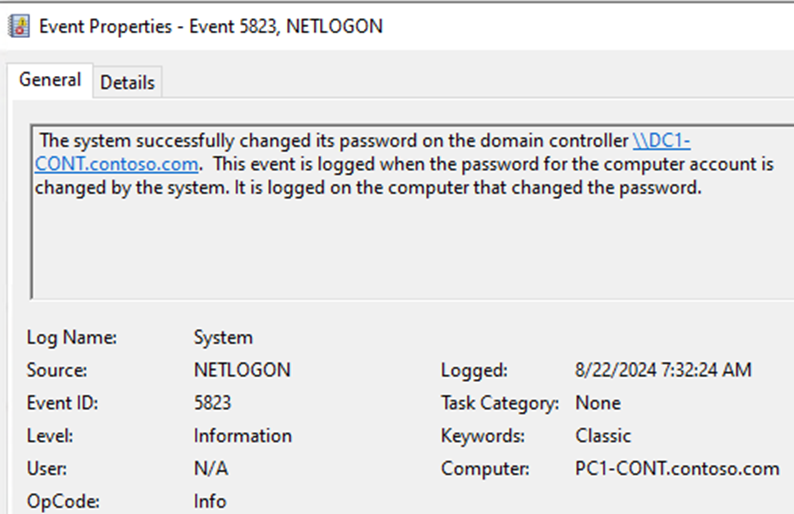

# Data collection for troubleshooting secure channel issues

To determine the cause of the secure channel issues, collect these data information.

## Obtaining client device information

On the affected device, check for successful password change events in System Event Viewer log (Event ID 5823 - Source: NETLOGON). This will help to find out the last time the password was changed by the system and use it as a reference value (if present - consider it could be overwritten by newer events):



> Log name: System  
> Source: NETLOGON  
> Description: The system successfully changed its password on the domain controller \\DCName.domain.com. This event is logged when the password for the computer account is changed by the system. It is logged on the computer that changed the password.

If Netlogon logging is enabled, you should also see a behavior with evidence for the password change from above Event ID 5823:

```output
08/22 07:32:23 [SESSION] [4128] CONTOSO: NlChangePassword: Doing it.
08/22 07:32:23 [SESSION] [4128] CONTOSO: NlChangePassword: Successful response from DC \\DC1-CONT.contoso.com
08/22 07:32:24 [SESSION] [4128] CONTOSO: NlChangePassword: Flag password changed in LsaSecret
08/22 07:32:24 [SESSION] [4128] CONTOSO: NlChangePassword: Flag password updated on DC
08/22 07:32:24 [MISC] [4128] Eventlog: 5823 (4) "\\DC1-CONT.contoso.com" 
08/22 07:32:24 [MISC] [4128] NlWksScavenger: Can be called again in # days (0x5265c00) --> The number of days here will match the "Maximum machine account password age" value defined on the computer changing the password. 
```

Compare computer account pwdLastSet (last time password was changed by computer known by Active Directory) attribute value in Active Directory and LSA secret on local machine (**cupdtime** value - last time password changed as per client computer/server knowledge):

## Obtaining LSA Secret value on affected computer/server

Follow these steps to look for the **cupdtime** value from registry.

> [!NOTE]
> By default, only "System" account has access to the registry key "HKLM\SECURITY", so you have 2 options, use PsExec tool to run the following steps in System context or give the desired user full permissions on above mentioned registry key (remember to remove them after no longer needed):

1. Run `reg query "HKLM\SECURITY\Policy\Secrets\$MACHINE.ACC\CupdTime"`.  


2. In this example, you receive the value **26A38C1AA0F4DA01**.

The value need to be converted by using w32tm before it can be understand. The hex value needs to be converted to decimal, but we need to revert the order for each pair of bits starting from the last one.

- Original value (26A38C1AA0F4DA01) turns into 01DAF4A01A8CA326
- Convert hexadecimal value into decimal (you can use the Calculator in Programmer mode). Result: 133688107438220070

Then, run the following command:

```console
w32tm /ntte 133688107438220070
```

You receive the following output:


The value is **154731 14:32:23.8220070 - 8/22/2024 7:32:23 AM**.

## Obtaining Active Directory pwdLastSet value

1. Open Active Directory Users and Computers console, navigate to the **Organizational Unit** where the computer object belongs to, and look for the pwdLastSet attribute to see the value:

   

2. Alternatively, you can use PowerShell (Active Directory module is required) and run:

   ```powershell
   Get-ADComputer '<ComputerName>' -properties PasswordLastSet | Format-List
   ```

   

3. The above information will give us the value for a single domain controller (the one we are connecting to through the console or when running the commands). Consider gathering the metadata for the affected computer object from Active Directory, this way you can confirm the value is consistent across all domain controllers in the environment:

Run the following command in cmd or PowerShell, just replace the Distinguished Name for the actual affected computer you are troubleshooting and export it to a file (easier to check information if you have a considerable number of Domain Controllers): 

```console
repadmin /showobjmeta * "CN=ComputerName,OU=Computers,DC=domain,DC=com" > c:\temp\ComputerName_Metadata.txt
```

Open the file and look for the values of the pwdLastSet attribute (you will get metadata for the object from all Domain Controllers available in the environment) and compare them, in a good scenario, the data in the attribute should be consistent in all Domain Controllers. You will see other attributes’ information on the output, but we are focusing just on the required attribute. This is an example of the output:


The above information will work as a reference and can help us in troubleshooting when secure channel is broken.
