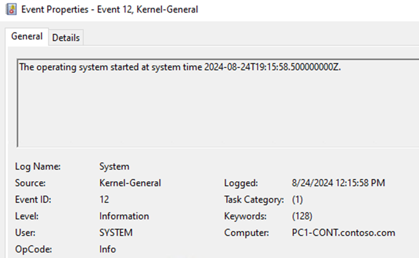

# Active Directory having newer pwdLastSet value than client device

After the information gathering process is performed, if you identify Active Directory has a newer value than the one obtained from affected computer, this could be caused by these common reasons:

## Reverting virtual machine to an old snapshot

- For this cause, there is no specific event you will find to confirm it was reverted to an old snapshot, but you can check if there are jumps in time within logs, for example, it will be suspicious if you find System Event Viewer events having a jump from February to July. That couple of months without data on a computer that is constantly in use, should be a reason to start questioning.
 
- Also, you can check if the system has started recently:

Event ID 12
Log name: System
Source: Kernel-General
Description: The operating system started at system time 2024-08-24T19:15:58.500000000Z.

- You can also check the uptime, if the Virtual Machine was reverted to a previous snapshot, the uptime would be recent (it could also be related to a desired operation, not only because of a snapshot reversion):

- You need to confirm if the boot time was provoked by a desired reboot of the machine. Communication with the user would be required to determine what was done on the computer.

## Restoring physical or virtual machine from bare metal backup

- This will be like the above cause. The first step will be to check with the backup solution administrator if there is any log to confirm any action on the affected device.
- You can also check if there are jumps in time within logs, for example, it will be suspicious if you find System Event Viewer events having a jump from February to July. That couple of months without data on a computer that is constantly in use, should be a reason to start questioning.
- Confirm if there is a recent uptime on the device too.

## Restoring machine from an old system restore point

You can investigate System and/or Application event viewer logs for events which indicate a system restore happened (ID:1208/8202)

Log Name:      System 
Source:        Microsoft-Windows-StartupRepair 
Event ID:      1208
Level:         Information 
User:          SYSTEM 
Description: Restored system to an earlier restore point. 
*********************
Log Name:      Application 
Source:        System Restore 
Event ID:      8202 
Level:         Information 
Description: Successfully restored system (Restore Operation).

## Unexpected shutdown or power outage

After the computer starts up, a “recovery” screen is presented, and the user chooses the default option which is restoring the machine back to the last system restore point. Also, Windows Embedded clients that are unexpectedly shut down after machine password change, the data on the Regfdata volume is lost and restored to the last known state, i.e. changes within HKLM\SECURITY\Policy\Secrets$machine.ACC would be lost if the machine lost power or was not cleanly shut down.
 
•	You can look for events about an unexpected shutdown or power outage (ID:41/6008)

Log Name:      System 
Source:        Microsoft-Windows-Kernel-Power 
Event ID:      41 
Task Category: (63) 
Level:         Critical 
Description: The system has rebooted without cleanly shutting down first. This error could be caused if the system stopped responding, crashed, or lost power unexpectedly. 
******************
Log Name:      System 
Source:        EventLog 
Event ID:      6008 
Description: The previous system shutdown at 9:03:23 AM on ‎6/‎28/‎2018 was unexpected.

•	VDI computers configured with pooled desktops that are based on an image and are restored to a snapshot when a user logs off (aka non-persistent machines).
 
•	On some VDI infrastructures, there are services having Netlogon as a dependency, we need to confirm if the service from the VDI Infrastructure is not manipulating the Netlogon service in a way that is avoiding Secure Channel operations.
•	Also, the affected device could be created from an image, and the machine can enter the environment having obsolete data regarding Secure Channel values according to what is on Active Directory.
•	This cause must be handled with VDI Infrastructure administrator.

Resolution
 
To repair Secure Channel (or Trust Relationship), you can run one of the following commands using domain admin credentials:
 
•	In cmd: nltest /sc_reset:domain_name or in PowerShell: Test-ComputerSecureChannel -Repair -Credential *
•	Reboot device.
